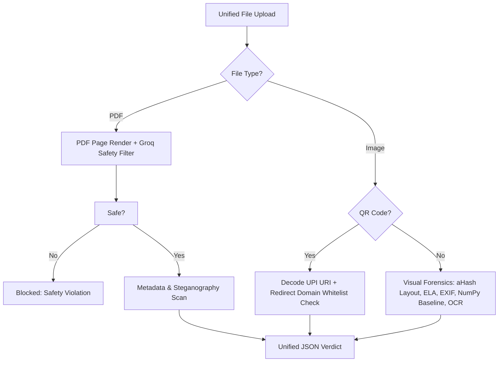

# TrustLayer AI

> **The Trust Verification Layer for Digital Payments**
>
> TrustLayer AI is a hybrid transaction forensic engine designed to verify payment integrity across digital channels. By analyzing payment screenshots, QR codes, transaction document details, and links with a deterministic-first, AI-second architecture, TrustLayer returns a mathematically verifiable Trust Score and actionable fraud insights in under 3 seconds.

*Enterprise-Ready Security. Live verification platform deployed at [trust-layer-tool.vercel.app](https://trust-layer-tool.vercel.app)*

📖 **[Read the Full Product Documentation & Case Study](./PRODUCT.md)**

---

## 🌌 Key Highlights & Features

### 1. ⚡ Unified Smart Scan Zone (Three Scanners in One)
Merchants no longer have to select whether they are scanning a receipt, document, or QR code. Drop any payment proof (JPEG, PNG, or PDF) into a single upload zone, and our backend router dynamically identifies the format:
* **PDFs**: Routed to the Document Threat Scanner.
* **QRs**: Decoded and analyzed by the QR Inspector.
* **Screenshots**: Routed to the Visual Forensics & OCR pipeline.

### 2. 🛡️ PDF Page Safety & Content Moderation
* **Visual Safety Assessment**: PDF pages are rendered as images on the server (up to 5 pages) using `PyMuPDF` (`fitz`).
* **Groq Vision Moderation**: Each page is scanned by our vision models to inspect for adult, explicit, NSFW, or violating content, immediately aborting execution and blocking unsafe uploads.

### 3. 🔍 Screenshot Forensics (9-Layer Pipeline)
* **Perceptual Layout Hashing (aHash)**: Generates a 64-bit fingerprint of the receipt layout and compares it against authentic PhonePe, Paytm, Google Pay, and super.money templates using Hamming distance checks.
* **Baseline Font Alignment**: Analyzes the horizontal baseline projections of text fields using NumPy to detect spliced text overlays or editing manipulation.
* **Error Level Analysis (ELA)**: Re-saves the image at a known JPEG quality to spot local compression differences indicative of doctoring.
* **EXIF Metadata Inspector**: Scans file headers for signature remnants of graphic editors (Photoshop, Canva, Figma).
* **Deepfake Receipt Classifier**: Detects AI-generated templates.

### 4. 🔗 QR Inspector (Phishing Redirect Resolver)
* **Redirect Resolver**: Follows HTTP/HTTPS redirects asynchronously to resolve short URLs (like bit.ly or custom forwarders) back to their final destination.
* **Domain Whitelisting**: Verifies resolved domains against a trusted UPI payment network whitelist to flag unverified or suspicious phishing domains.

---

## 🛠️ Architecture & Tech Stack



* **Frontend**: Next.js (App Router), React, premium HSL design system (optimized dark/light modes, floating segmented tab navs, glassmorphic hover cards).
* **Backend**: FastAPI, Python, PyMuPDF, Pillow, NumPy (pixel matrix line profiling).
* **AI Engine**: NVIDIA NIM APIs & Groq Vision (Llama-4, Qwen MoE, Nemotron-VL).
* **Database**: Supabase (Postgres, transaction pHash history).

---

## 🚀 Quick Start (Local Run)

### Prerequisites
1. Ensure your system has Node.js (v18+) and Python 3.10+ installed.
2. Clone the repository and configure a `.env` file in the root:
   ```env
   NVIDIA_API_KEY=your_nvidia_nim_api_key
   NVIDIA_BASE_URL=https://integrate.api.nvidia.com/v1
   OCR_MODEL=nvidia/llama-3.1-nemotron-nano-vl-8b-v1
   QWEN_MODEL=qwen/qwen3.5-122b-a10b
   ```

### 1. Start the FastAPI Backend
```bash
# Install python dependencies
pip install -r requirements.txt

# Run FastAPI app
python -m uvicorn backend.main:app --port 8000
```

### 2. Start the Next.js Frontend
```bash
# Install packages
npm install

# Run dev server
npm run dev
```
Open [http://localhost:3000/product](http://localhost:3000/product) to scan!

---

## 🧪 Demo Mode
Click the **"Load Demo Screenshot"** option inside the dashboard to synthesize an SVG PhonePe proof client-side and verify the active diagnostics scan immediately.

---

## ⚖️ License
MIT License. Built for payment verification excellence.
