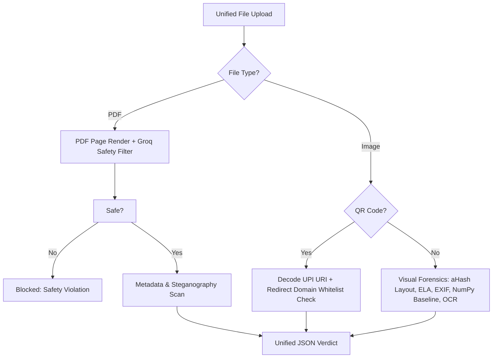

# TrustLayer AI

> **The Trust Verification Layer for Digital Payments**
>
> TrustLayer AI is a hybrid transaction forensic engine designed to verify payment integrity across digital channels. By analyzing payment screenshots, QR codes, transaction document details, and links with a deterministic-first, AI-second architecture, TrustLayer returns a mathematically verifiable Trust Score and actionable fraud insights in under 3 seconds.

*Enterprise-Ready Security. Live verification platform deployed at [trust-layer-tool.vercel.app](https://trust-layer-tool.vercel.app)*

📖 **[Read the Full Product Documentation & Case Study](./PRODUCT.md)**

---

## 🌌 Key Highlights & Features

### 1. ⚡ Unified Smart Scan Zone (Three Scanners in One)
Merchants no longer have to select whether they are scanning a receipt, document, or QR code. Drop any payment proof (JPEG, PNG, or PDF) into a single upload zone, and our backend router dynamically identifies the format:
* **PDFs**: Routed to the Document Threat Scanner.
* **QRs**: Decoded and analyzed by the QR Inspector.
* **Screenshots**: Routed to the Visual Forensics & OCR pipeline.

### 2. 🛡️ PDF Page Safety & Content Moderation
* **Visual Safety Assessment**: PDF pages are rendered as images on the server (up to 5 pages) using `PyMuPDF` (`fitz`).
* **Groq Vision Moderation**: Each page is scanned by our vision models to inspect for adult, explicit, NSFW, or violating content, immediately aborting execution and blocking unsafe uploads.

### 3. 🔍 Screenshot Forensics (9-Layer Pipeline)
* **Perceptual Layout Hashing (aHash)**: Generates a 64-bit fingerprint of the receipt layout and compares it against authentic PhonePe, Paytm, Google Pay, and super.money templates using Hamming distance checks.
* **Baseline Font Alignment**: Analyzes the horizontal baseline projections of text fields using NumPy to detect spliced text overlays or editing manipulation.
* **Error Level Analysis (ELA)**: Re-saves the image at a known JPEG quality to spot local compression differences indicative of doctoring.
* **EXIF Metadata Inspector**: Scans file headers for signature remnants of graphic editors (Photoshop, Canva, Figma).
* **Deepfake Receipt Classifier**: Detects AI-generated templates.

### 4. 🔗 QR Inspector (Phishing Redirect Resolver)
* **Redirect Resolver**: Follows HTTP/HTTPS redirects asynchronously to resolve short URLs (like bit.ly or custom forwarders) back to their final destination.
* **Domain Whitelisting**: Verifies resolved domains against a trusted UPI payment network whitelist to flag unverified or suspicious phishing domains.

---

## 🛠️ Architecture & Tech Stack



* **Frontend**: Next.js (App Router), React, premium HSL design system (optimized dark/light modes, floating segmented tab navs, glassmorphic hover cards).
* **Backend**: FastAPI, Python, PyMuPDF, Pillow, NumPy (pixel matrix line profiling).
* **AI Engine**: NVIDIA NIM APIs & Groq Vision (Llama-4, Qwen MoE, Nemotron-VL).
* **Database**: Supabase (Postgres, transaction pHash history).

---

## 🩺 Reliability & Deployment Integrity

Three fixes went in after an internal judge-mode audit surfaced real gaps — documenting
them here on purpose, not hiding them:

* **One canonical deployment, verifiable at runtime.** Earlier, this repo had multiple
  overlapping entrypoints (a root-level `backend/main.py` stub from an early prototype,
  a duplicate `whatsapp/main.py`), and the live Twilio-facing deployment had drifted out
  of sync with `main` — a test image produced a response that didn't match any code in
  the repo. The canonical path is now `artifacts/tustlayer/` → `api/index.py` →
  `backend/main.py`, everything else deprecated (`HTTP 410`), and `GET /api/v1/version`
  reports the exact git commit/branch/deploy time currently live, so this can be
  verified in one `curl` instead of by inspection.
* **AI reasoning is grounding-checked, not trusted blindly.** The LLM-generated
  "why" bullets in a Trust Score result are checked for real overlap with the actual
  OCR-extracted text and fields before being shown to a user. Any bullet that isn't
  traceable to something the pipeline actually found is discarded server-side, not
  surfaced — a "verifiable trust score" product can't afford an occasional hallucinated
  explanation, even a rare one.
* **Out-of-scope images get an honest answer, not a guess.** The scanner is built to
  verify *completed* payment receipts. An image with too little extractable payment
  data and no confirmed payment status (a pre-payment screen, an unrelated photo, a
  mockup) now short-circuits to a clear "this doesn't look like a payment receipt"
  message — on the web app and the WhatsApp bot — instead of running full AI reasoning
  on insufficient data.

---

## 🚀 Quick Start (Local Run)

### Prerequisites
1. Ensure your system has Node.js (v18+) and Python 3.10+ installed.
2. Clone the repository and configure a `.env` file in the root:
   ```env
   NVIDIA_API_KEY=your_nvidia_nim_api_key
   NVIDIA_BASE_URL=https://integrate.api.nvidia.com/v1
   OCR_MODEL=nvidia/llama-3.1-nemotron-nano-vl-8b-v1
   QWEN_MODEL=qwen/qwen3.5-122b-a10b
   ```

### 1. Start the FastAPI Backend
```bash
# Install python dependencies
pip install -r requirements.txt

# Run FastAPI app — NOTE: the real backend lives under artifacts/tustlayer.
# Do not run backend.main from the repo root — that path is a deprecated
# early-prototype stub (returns HTTP 410) and is not the scanning pipeline.
cd artifacts/tustlayer
python -m uvicorn backend.main:app --host 0.0.0.0 --port 8000 --reload
```

Verify you're running the right thing:
```bash
curl http://localhost:8000/api/v1/version
# { "git_commit": "...", "git_branch": "...", "deployed_at": "..." }
```
Check this against `git log -1 --oneline` before every demo — see
[Reliability & Deployment Integrity](#-reliability--deployment-integrity) below.

### 2. Start the Next.js Frontend
```bash
# Install packages
npm install

# Run dev server
npm run dev
```
Open [http://localhost:3000/product](http://localhost:3000/product) to scan!

---

## 🧪 Demo Mode
Click the **"Load Demo Screenshot"** option inside the dashboard to synthesize an SVG PhonePe proof client-side and verify the active diagnostics scan immediately.

---

## 🗺️ Known Limitations & Roadmap

Built in a hackathon window, so scoping this honestly:

* **Test coverage is thin.** The deterministic scoring engine (`trust_score/engine.py`)
  is the most rule-heavy, highest-stakes code in the project and doesn't yet have a
  golden-case regression suite — that's the first thing we'd add with more time.
* **Fraud-template matching is seeded with placeholder data**, not a real scam-image
  database. It works structurally (perceptual hashing + Hamming distance) but needs a
  real, growing dataset — ideally sourced via a bank/NPCI partnership rather than
  self-collected, since India's actual fraud-report data (CFCFRMS) isn't openly
  accessible to non-regulated entities.
* **Per-scan cost is demo-scale, not India-scale.** A single screenshot can trigger
  ~8 parallel LLM calls across two providers. At real WhatsApp volume this needs
  consolidating into fewer, structured multimodal calls, plus caching on repeated
  VPA/URL lookups.
* **Auth is not production-grade.** Firebase token verification is currently a
  placeholder, and Twilio webhook signature validation is skippable when unset —
  fine for a demo, not for handling real financial data.
* **External verification is inherently a proxy, not ground truth.** NPCI doesn't
  expose real-time UPI transaction verification to non-bank entities — nothing here
  changes that regulatory ceiling. Razorpay's VPA lookup (what we use) is one of the
  few third-party-accessible signals available today; true ground-truth verification
  would require a licensed bank/PSP partnership, which is the real unlock for this
  product, not just more engineering time.

---

## ⚖️ License
MIT License. Built for payment verification excellence.
