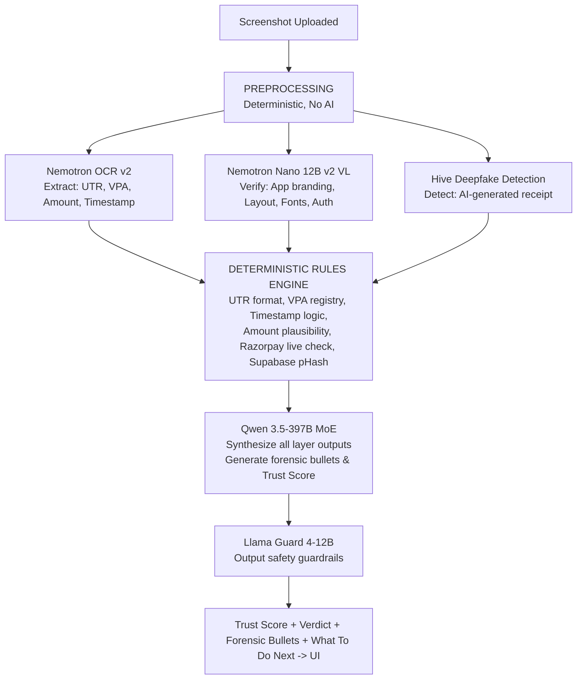

# TrustLayer AI

> **The Trust Verification Layer for Digital Payments**
>
> TrustLayer AI is India's first hybrid forensic engine designed to analyze every digital artifact involved in a payment transaction — UPI screenshots, QR codes, documents, and links. Built with a deterministic-first, AI-second architecture, it returns a mathematically verifiable Trust Score and actionable guidance in under 10 seconds.

**Team Hackfinity | WinnovX 2026**
*Built on real data. Deployed at [trust-layer-tool.vercel.app](https://trust-layer-tool.vercel.app)*

📖 **[Read the Full Product Documentation & Case Study](./PRODUCT.md)**

---

## 🌌 Key Highlights & Features

### 1. 🔍 Fake Screenshot Detector (9-Layer Pipeline)
TrustLayer runs a 9-layer forensic pipeline simultaneously, catching both lazy fakers and sophisticated fraudsters.
* **Deterministic Rules Engine:** Hard mathematical checks execute first. If a UTR number has 8 digits instead of 12, it's flagged instantly. No AI hallucination can override this.
* **Visual Forensics & Branding:** Leverages **NVIDIA Nemotron Nano 12B v2 VL** to classify and verify the container app by scanning branding icons, logos, header colors, and font families.
* **Deep Metadata History Forensics:** Scans raw binary headers (EXIF) for signature remnants of editing software like Photoshop, Canva, or Figma.
* **AI-Generated Receipt Detection:** Identifies AI-generated deepfake receipts (DALL-E, Stable Diffusion) using a dedicated binary classifier.
* **Network-Effect Replay Detection:** Every scanned screenshot gets a perceptual hash (pHash) stored in **Supabase**. If a fake screenshot has fooled someone before, TrustLayer catches it instantly.

### 2. 🛡️ QR Code Fraud Inspector
Decodes and verifies embedded QR payloads.
* **UPI ID Consistency:** Checks if the QR points to a different UPI ID than what's stated in the text.
* **Phishing URL Check:** Immediately validates any embedded URLs against Google Safe Browsing.

### 3. 📄 Document & Image Threat Scanner
Extends beyond screenshots to scan PDF invoices, bank statement images, and confirmation documents.
* **PDF Analysis (PyMuPDF):** Detects font diversity anomalies, invisible white text layers, and overlapping element replacement edits.
* **URL Verifier & Malware Scan:** Extracts, resolves, and batch-checks URLs against Google Safe Browsing and VirusTotal.

### 4. 🤖 WhatsApp Bot (Beta)
India-scale distribution with zero learning curve. Users can simply forward a payment screenshot to TrustLayer's WhatsApp Business number and receive a full verdict in 10 seconds, without leaving the app.

---

## 🛠️ Architecture & Tech Stack



* **Frontend:** Next.js (App Router), React, premium Vanilla CSS (dark/light mode, glassmorphism, responsive micro-animations).
* **Backend:** FastAPI, Python, PyMuPDF, Pillow (pixel manipulation & EXIF recursive analysis).
* **AI Engine:** NVIDIA NIM APIs (Nemotron OCR v2, Nemotron Nano 12B v2 VL, Qwen 3.5-397B MoE, Meta Llama Guard, Microsoft Phi-4).
* **Database & Auth:** Supabase (Postgres, pHash storage, event logging).

---

## 🚀 Quick Start (Local Run)

### Prerequisites
1. Ensure your system has Node.js (v18+) and Python 3.10+ installed.
2. Clone the repository and configure a `.env` file in the root:
   ```env
   NVIDIA_API_KEY=your_nvidia_nim_api_key
   NVIDIA_BASE_URL=https://integrate.api.nvidia.com/v1
   OCR_MODEL=nvidia/llama-3.1-nemotron-nano-vl-8b-v1
   QWEN_MODEL=qwen/qwen3.5-122b-a10b
   FALLBACK_MODEL=microsoft/phi-4-mini-instruct
   ```

### 1. Start the FastAPI Backend
```bash
# Install python dependencies
pip install -r requirements.txt

# Run FastAPI app
python -m uvicorn backend.main:app --port 8000
```
FastAPI endpoints will be live at `http://localhost:8000`. You can access the standard interactive Swagger UI at `/docs`.

### 2. Start the Next.js Frontend
```bash
# Install packages
npm install

# Run next dev server
npm run dev
```
Open [http://localhost:3000/product](http://localhost:3000/product) with your browser to experience the forensic scanner!

---

## 🧪 One-Click Demo Mode (No Download Required)
To evaluate the end-to-end pipeline instantly without needing local receipts, simply click the **"Load Demo Screenshot"** option inside the upload dashboard. This synthesizes and base64-encodes a high-fidelity vector SVG of a real PhonePe receipt directly on the client, ready to test the entire active scan diagnostics pipeline.

---

## ⚖️ License
Released under the MIT License. Built for payment verification excellence.
